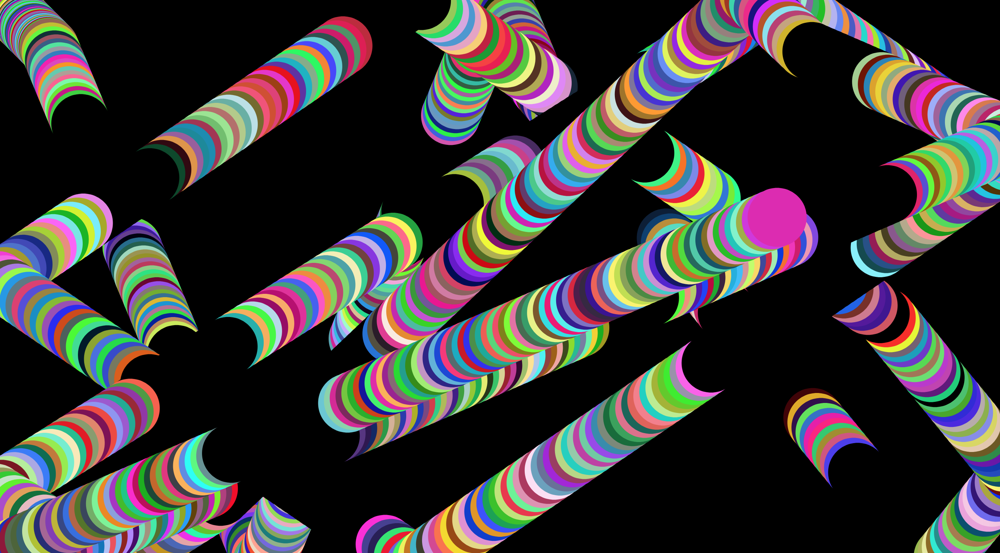

Victoria Ruebusch

[Live Sketch Link](https://vruebusch.github.io/120-work/HW-7/)

# HW 7 | Describe then Alter the Bouncing Ball

## Description of What the Original Code is Doing

The original code has set up boundaries for an ellipse to stay within. These boundaries are the browser's screen and each time the ellipse arrives at the edge, it seems to bounce off or ricochet. Everytime the mouse is clicked, the angle of the ball's position also changes.

Here ↓ you are defining ball as an object and setting up variables for properties of the ball that will be used later.

``let ball = {};
      ball.width = 40;
      ball.x = 10;
      ball.y = 10;
      ball.delta_x = 1;
      ball.delta_y = 1;
      ball.scale_x = 1;
      ball.scale_y = 1;``

This ↓ sets up the function setup, creates a canvas and colors the background.

``function setup() {
    createCanvas(windowWidth, 400);
    background(255);
}``

Declares draw function ↓

``function draw() {``

↓ Changing x and y coordinates of the ball

`` ball.x += ball.delta_x * ball.scale_x;
    ball.y += ball.delta_y * ball.scale_y;``

This ↓ creates the boundary for the ball

``if (ball.x >= width || ball.x <= 0) {
        ball.delta_x = -1 * ball.delta_x;
    }
    if (ball.y >= height || ball.y <= 0) {
        ball.delta_y = -1 * ball.delta_y;
    }``

The ball characteristics / draws the ball ↓

``fill(255);
    ellipse(ball.x, ball.y, ball.width, ball.width);
}
``

Changes the angle of the ball path when mouse is pressed ↓

``function mousePressed() {
    ball.scale_x = map(mouseX, 0, width, 0.5, 10);
    ball.scale_y = map(mouseY, 0, height, 0.5, 10);
}``

## How did you alter the sketch?

For my sketch I altered the appearance of the circles by randomizing each circle's fill color, removing the stroke, and changing the size. Also, everytime the mouse gets held down, the circles turn black which makes them blend in with the black background. I was able to accomplish the mouse pressing feature by using 'if' and 'else'.

``  if (mouseIsPressed) {
          noStroke();
          fill('black');
          ellipse(ball.x, ball.y, ball.width, ball.width);
  } else {
        noStroke();
        fill(red,green,blue);
        ellipse(ball.x, ball.y, ball.width, ball.width);
  }``

