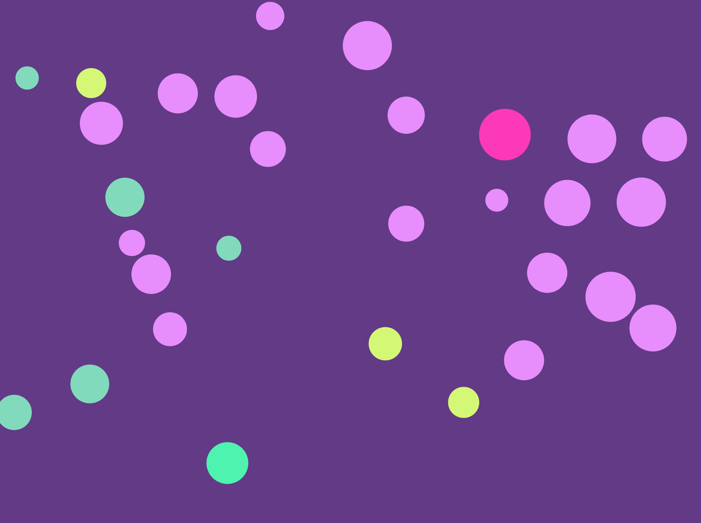

Victoria Ruebusch

[HW-12 Live Sketch. Hover over balls!](https://vruebusch.github.io/120-work/hw-12/)

# **HW-12 Response**

## Summary
This week we learned how to make objects interact with one another. For example, making objects bounce off of eachother (which is what I did). We also learned that classes can be saved into other .js files.

## Steps Taken
- Create the ball variable and numbered the amount of balls that will be displayed
- Declared the setup function
- Created the canvas
- Created the parameters for the new ball
- Created a new object
- Specified where the balls will begin on the canvas
- Declared the setup function
- Set the background color
- Created the parameters for when the ball is called
- Created a mouse pressing function that will affect the balls everytime the mouse hovers over a ball (it will change color)
- Created the Ball class
- Specified how to ball will display on the canvas
- Specified how the hover effect works
- Specified how the balls will move
- Created an edge check and for the balls to bounce off of other balls
- Specified how the balls' colors will change when bouncing off of other things

**A Screenshot of my Final Sketch:**

## Issues
It took me quite a while to actually create a functioning sketch. I'm happy with the way it turned out, but it took longer than I'd like. I know this is complicated stuff, but I wish I was understanding better so that I could make more creative sketches. This looks simple, but the code that goes into it is difficult and you have to make sure you're actually writing everything correctly. I'm just glad I was able to actually turn something in this week (even if it's late).

## Final Thoughts

Hopefully the next assignment won't take me as long as the past couple have taken me.
