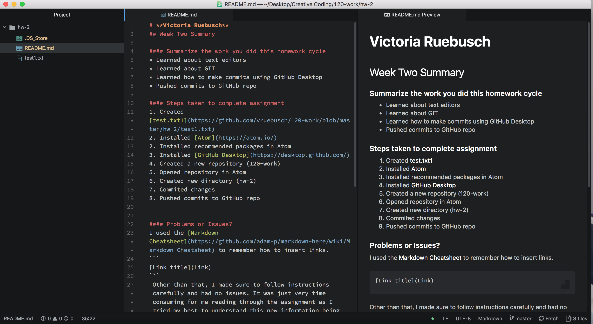

# **Victoria Ruebusch**
## Week Two Summary

#### Summarize the work you did this homework cycle
* Learned about text editors
* Learned about GIT
* Learned how to make commits using GitHub Desktop
* Pushed commits to GitHub repo

#### Steps taken to complete assignment
1. Created [test.txt1](https://github.com/vruebusch/120-work/blob/master/hw-2/test1.txt)
2. Installed [Atom](https://atom.io/)
2. Installed recommended packages in Atom
3. Installed [GitHub Desktop](https://desktop.github.com/)
4. Created a new repository (120-work)
5. Opened repository in Atom
6. Created new directory (hw-2)
7. Commited changes
8. Pushed commits to GitHub repo


#### Problems or Issues?
I used the [Markdown Cheatsheet](https://github.com/adam-p/markdown-here/wiki/Markdown-Cheatsheet) to remember how to insert links.
```
[Link title](Link)
```
 Other than that, I made sure to follow instructions carefully and had no issues. It was just very time consuming for me reading through the assignment as I tried my best to understand this new information being presented to me. I'm now understanding things better and hopefully future tasks won't be too challenging or time consuming for me.

#### Anything in particular you learned that you would like to discuss further?
I'm just excited to see where this course takes me and what I will learn along the way. I know this is only the beginning and it's still cool to see what we can be capable of even at the most basic level. It's like a new way of doing things and that's exciting to me.

#### How did you help classmates with any issues they had?
I have checked in on my classmates' issues to see if I could help in any way, but others seemed to cover it by the time I went to check. I fear that some questions might be too difficult for me to answer in the future, but I'll try my best. I found my classmates' responses to issues helpful even for myself and at some points I looked at others' assignments as a model.


