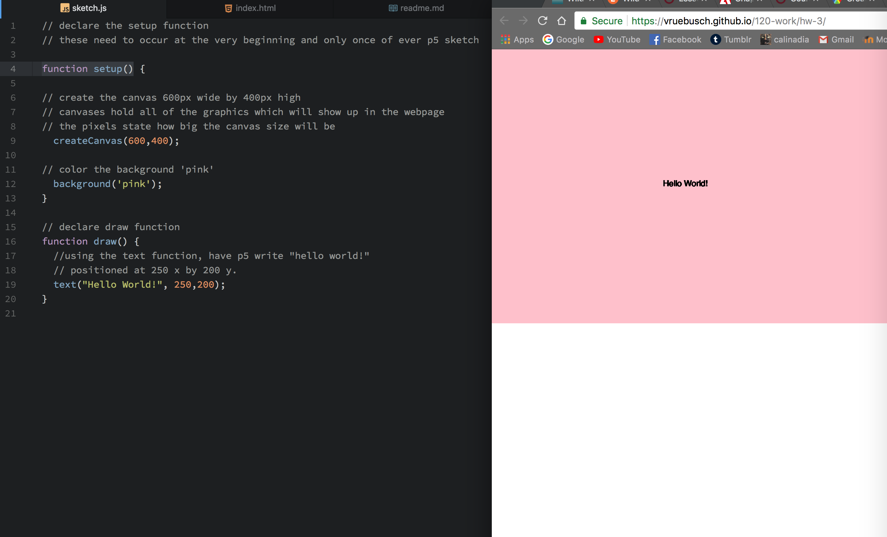

Victoria Ruebusch

["Hello World!" Sketch](https://vruebusch.github.io/120-work/hw-3/)

# **HW-3 Response**

## Summary

This week we have been introduced to [p5.js](http://hello.p5js.org/) and have taken the first steps in creating our very own p5.js sketches. This week was about becomming familiar with the basics of p5.js that will help us later on with more advanced tasks. The main topics we learned were the importance of declaring the setup function, creating a canvas, coloring in the background for our canvas, and making a live p5 webpage through [GitHub pages](https://pages.github.com/).

## Steps Taken
*side note: these are the steps taken for the finished project, not the steps where I familiarized myself with p5.js and created "Hello World", made a circle, etc.*
1. Downloaded "empty-example" directory which included:

    -p5_lib

    -index.html

    -sketch.js

2. Duplicated and renamed the directory "hw-3" (in the end).

3. Declared the setup function.
``
function setup() {}
``

4. Created the canvas and made it 600px by 400px.
``
createCanvas(600,400);
``

5. Made the background pink.
``
background('pink');
``

6. Declared the draw function.
``
function draw() {}
``

7. Created text
``
text("Hello World!", 250,200);
`` to be somewhat centered on the canvas.

**This is what my final sketch looks like:**

## Issues

I didn't have any issues as this was a fairly straightforward lesson. I'm super excited to utilize this new information and begin more creative tasks in the following weeks.

## Final Thoughts

I'm still blown away how all of this is possible and that there's so much we can create with code. I know we're just now learning basic stuff, but even this excites me because I get to see the outcome of my work (in a webpage). I'm thoroughly enjoying this course and can't wait to learn more about p5.js. I haven't been able to help out much on the issues board (yet) because I normally start my assignment later in the week than most people and haven't been able to look at the assignment for myself yet. I'll try to start sooner so that I can be of more help to others. Especially since I consider myself to be a problem solver (which is why I prefer to try and solve things on my own), but I could also give helping others a try.
