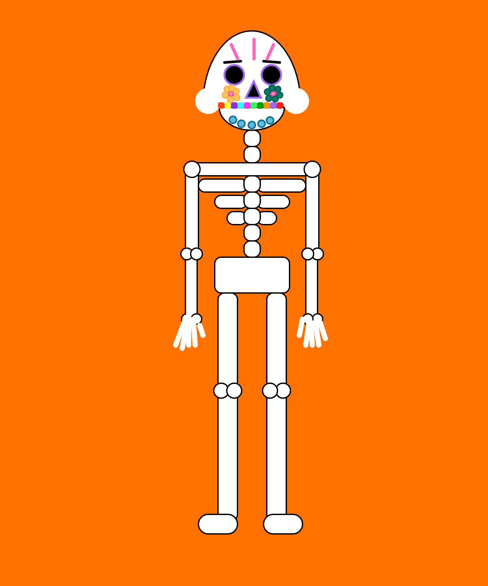

Victoria Ruebusch

[Monster Portrait](https://github.com/vruebusch/120-work/blob/master/hw-4/Skeleton.png)

# **HW-4 Response**

## Summary
This week we finally got into drawing using shapes and learning how to use color! We learned all about 2D Primitives shapes and how to use them along our canvas which basically acts as a graph/grid. Shapes are placed along the x and y axis and you can even change their width and height. We also learned about strokes and got a better understanding on how to use color. We were to create either a self portrait or monster using these shapes, and I chose the latter because I thought it might be difficult to draw hair. In the end, I ended up creating a Day of the Dead skeleton of some sort, and let me tell you, it's not easy drawing bones. 

## Steps Taken
- Made a copy of the empty-example folder. Labled it hw-4.
- Colored the background orange.
- Started with the skull and made my way down.
- Decorated with flowers and other markings.

**This is what my final sketch looks like:**

If you take a closer look, you can see that I colored each tooth a different color.
## Issues
I had a slight issue trying to figure out how to use arcs, but in the end, I managed (I used arcs for the skull). In general, it seemed to take a while figuring out where to position everything. I kept getting the x and y coordinated mixed up for some reason, and when I started working with negative numbers that forced me to think even harder. Many trial and error and saving and refreshing. I can't wait to learn new functions so that I have more tools to work with.

## Final Thoughts

What a fun (and tedious) assignment! The only reason it might have taken me longer than normal is because I'm a perfectionist and wanted everything to look decent. Also, positioning everything took forever. I had fun trying out the new functions and making something creative for a change! Looking forward to learning more, as always.
