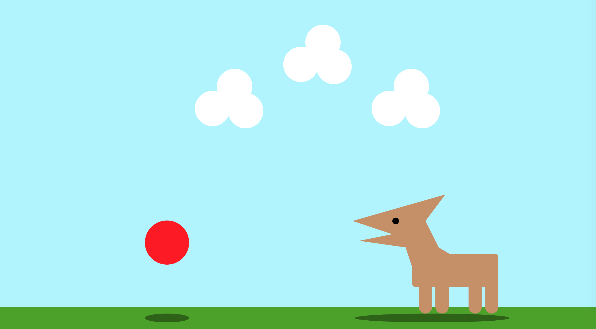

Victoria Ruebusch

[Dog chases ball](https://vruebusch.github.io/120-work/hw-5/)

# **HW-5 Response**

## Summary
This week we learned how to animate using variables and the drawing functions we learned last week. We learned that the draw function is constantly looping which enables animation. My favorite thing learned this week is the `noCursor()` function which you can then replace with a shape. For my sketch, I replaced the cursor with a ball and had a dog chase it.

## Steps Taken
- Made a blue sky
- Replaced the cursor with a red ball
- Created grass
- Made a shadow for the ball
- Animated clouds (moving to the left)
- Created a 'dog' that moved along with the cursor, like it's chasing after the ball
- Made a shadow for the dog
- (and many other unnamed attempts)

**A Screenshot of my Final Sketch:**

## Issues
Through much trial and error, I created the end result which you can see. There was a lot more I wanted to add like looping clouds, moving legs (when the dog walked), and maybe even a wagging tail. I did attempt all of these, but the code ended up messing up, or I didn't get the correct result. Hopefully as I learn more and become more comfortable with animation, I can attempt to add these. This was definitely a challenging lesson for me because I didn't exactly understand how to use variables 100%.

## Final Thoughts

The end result seems simple enough, but it definitely took a while to get the hang of all these new tools being introduced. I just wish I could have done more, but for now, my knowledge is pretty limited. With all the trial and error I went through, I got some practice with animation (and variables), but I think I need to practice a lot more.
