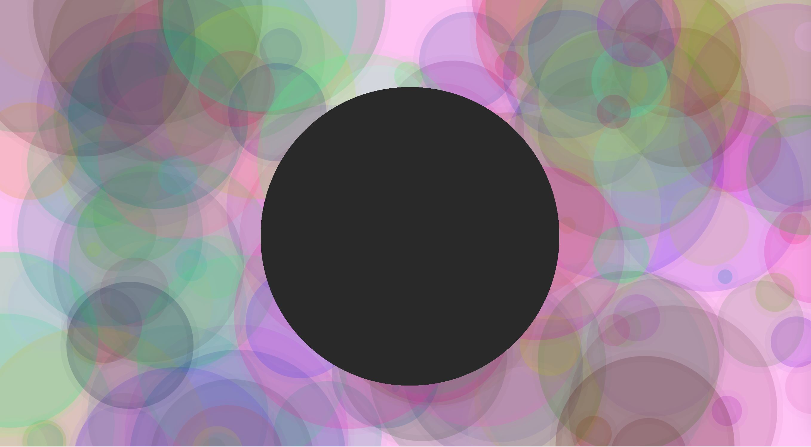

Victoria Ruebusch

[Bubbles](https://vruebusch.github.io/120-work/hw-6/)

# **HW-6 Response**

## Summary
This week we learned about map functions, Console Log, math functions,  random number generators, JavaScript objects, and stringe. All of these elements are used in animation, and I found that everything I learned this week answered many of the questions I had last week. For example, having the ``contrain()`` function as a kind of boundary, would have been helful last week. For my sketch this week I wanted to create colorful bubbles that varied in size and color. Also a giant ellipse in the center that changes from black and white depending where you position the mouse.

## Steps Taken
- created the bubbles first (size, color, stroke weight, stroke color)
- made a pink background
- using random number generators and 'let' I was able to have the bubbles become different sizes and color
- created the center ellipse and gave it the map function

**A Screenshot of my Final Sketch:**

## Issues

At first I couldn't figure out how to use 'var' or JavaScript objects (where you can sort everything under the same name), but then I changed it to 'let' and moved it under the draw function. For some reason it wouldn't work at the very beginning or in the setup function. I have seem to forgot the difference between 'var' and 'let' and I never know which one to use. Also, everytime I tried to use JavaScript objects it didn't work.

## Final Thoughts

The math part kind of intimidated me at first, but I knew it was going to come up eventually. At least it isn't anything too difficult (yet) and only helps create an even better picture when coding. I love how the more we learn the more questions I have are being answered and I hope I can remember how to utilize everything. Sometimes it is a bit offputting when I have an idea, but get errors or know I'm not doing something right so I end up making it easier on myself and changing my original plan. At least I'm able to create something in the end and I challenge myself and practice before giving up and trying something else.
